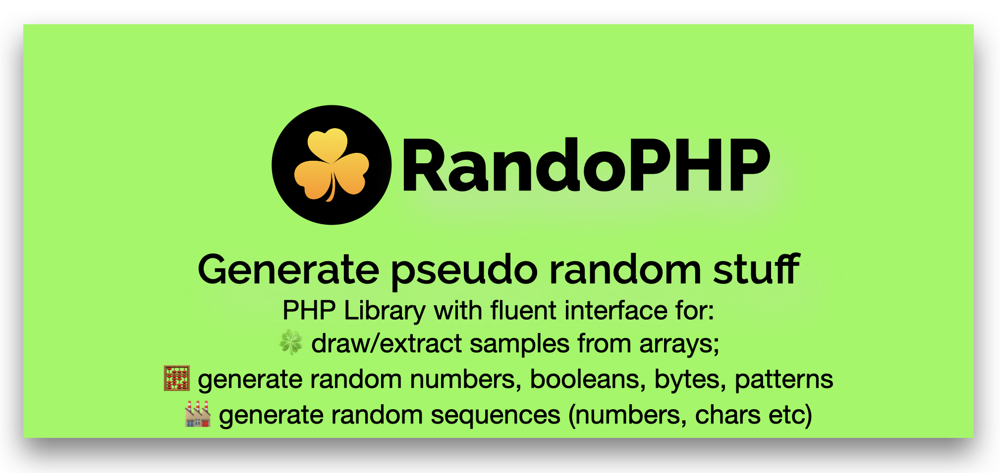

# Rando-PHP


[](https://github.com/Hi-Folks/rando-php/actions/workflows/php.yml)


RandoPHP is a PHP open source package for random stuff. With this package you can:
- **Draw**: Extract random items (sample) from an array. This is useful when you want to "draw" some numbers or items;
- **Generate**: useful for create random
   - *item* like integer, byte, boolean, float, lat/long coordinates, char (numeric, alphabetic, alphanumeric);
   - *sequences* like array of integer or char;

With the fluent interface you can control some things like:
- minimum and maximum value for generation;
- how many items you want to create;
- for sequences if you want or not duplicates ([1,5,3,1,1], 1 is duplicate or [1,6,5,3,8], no duplicates);
- And other stuff, see the documentation for more options.

## Table of contents

- [Installation](#installation)
- [Usage, how to generate:](#usage)
  - [Random char](#generate-char)
  - [Random boolean](#generate-boolean)
  - [Random float](#generate-a-float)
  - [Random integer](#generate-an-integer)
  - [Random Bytes](#generate-bytes)
  - [Random Date](#generate-a-date)
  - [Random Sequences](#generate-sequences)
  - [Random Chars](#random-chars)
- [Usage, how to extract random values from array/list](#draw-random-stuff)


## Installation

You can install the package via composer:

```bash
composer require hi-folks/rando-php
```

## Usage

In order to import the right class:
```php
use HiFolks\RandoPhp\Randomize;
```

### Generate Char

Sometimes you want to obtain a random char, for example, a numeric char:

```php
Randomize::char()->numeric()->generate();
```
Or you might want an alphabetic char ():

```php
Randomize::char()->alpha()->generate();
```

You can even do both!
```php
Randomize::char()->alphanumeric()->generate();
```

You can generate a lower case char:
```php
Randomize::char()->alpha()->lower()->generate();
```
You can generate an upper case char:
```php
Randomize::char()->alpha()->upper()->generate();
```


You can generate a special character.
A special character is one of '!"#$%&'()*+,-./:;<=>?@[\]^_`{|}~':
```php 
Randomize::char()->specialCharacters()->generate();
```

### Generate Boolean

Sometimes you want to obtain a random boolean true or false (flip a coin):

``` php
$randomBool = Randomize::boolean()->generate();
```
### Generate a Float

Sometimes you want to obtain a random float (default min - max range of 0.0 - 1.0). For example, you want to generate a random temperature for a day:

```php
$randomFloat = Randomize::float()->generate();
```

Or you can set the min - max range of 0 - 90 , which is equivalent to ->min(0)->max(90)

```php
$randomFloat = Randomize::float()->min(0)->max(90)->generate();
```

### Generate an Integer

Sometimes you want to obtain a random integer (min - max range). For example, you want to roll the dice:

``` php
$randomNumber = Randomize::integer()->min(1)->max(6)->generate();
```
The same thing using range() method, instead of min() and max():

``` php
$randomNumber = Randomize::integer()->range(1,6)->generate();
```

You can use a shortcut helper to generate an integer calling the constructor with min and max:

``` php
$randomNumber = Randomize::integer(1,6)->generate();
```


### Generate bytes
Sometime you want to obtain some random bytes (hexadecimal). For example, you want to generate a random RGB color (a hex triplet in hexadecimal format):

```php
$randomRGB = Randomize::byte()->length(3)->generate();
```

### Generate a Date
Sometimes you want to obtain a random date (default min - max range of First day of current year - Last day of current year). For example, you want to generate a random date:

```php
$randomDate = Randomize::datetime()->generate();
```

Or you can set the min - max range of 01-01-2020 - 10-01-2020 , which is equivalent to ->min('01-01-2020')->max('10-01-2020'):
```php
$randomDate = Randomize::datetime()->min('01-01-2020')->max('10-01-2020')->generate();
```

You can even specify your preferred format for the random date generated, by using ->format('d-M-Y'):
```php
$randomDate = Randomize::datetime()->format('d-M-Y')->generate();
```

### Generate sequences
Sometime you want to obtain some random sequences. For example, you want to roll the dice 15 times:

```php
$randomRolls = Randomize::sequence()->min(1)->max(6)->count(15)->generate();
```

Sometime you want to obtain some random char sequences. For example, char sequences of length 10:

```php
$randomChars = Randomize::sequence()->chars()->count(10)->generate();
```

Or you might want numeric char sequences.

```php
$randomChars = Randomize::sequence()->chars()->numeric()->count(10)->generate();
```

Or you might want alphabetical char sequences.

```php
$randomChars = Randomize::sequence()->chars()->alpha()->count(10)->generate();
```

Yes, even both.

```php
$randomChars = Randomize::sequence()->chars()->alphanumeric()->count(10)->generate();
```

You want 20 lower case chars:
```php
Randomize::sequence()->chars()->alphaLowerCase()->count(20)->asString()->generate();
```

You want 20 upper case chars:
```php
Randomize::sequence()->chars()->alphaUpperCase()->count(20)->asString()->generate();
```


Sometime you want to obtain some random sequences with **no duplicates**. For example, you want to play "Tombola" (extracting number from 1 to 90 with NO duplicates):

```php
$randomTombola = Randomize::sequence()->min(1)->max(90)->count(90)->noDuplicates()->generate();
```

Sometime you want to obtain some random char sequences with **no duplicates**.

```php
$randomChars = Randomize::sequence()->chars()->count(10)->noDuplicates()->generate();
```

Or you might want numeric char sequences with **no duplicates**. For example, char sequences of length 10:

```php
$randomChars = Randomize::sequence()->chars()->numeric()->count(10)->noDuplicates()->generate();
```

Or you might want alphabetical char sequences with **no duplicates**.

```php
$randomChars = Randomize::sequence()->chars()->alpha()->count(10)->noDuplicates()->generate();
```

Yes, even both and with **no duplicates**.

```php
$randomChars = Randomize::sequence()->chars()->alphanumeric()->count(10)->noDuplicates()->generate();
```

### Random Chars
If you want to generate random string (alphanumeric, only letters, only numbers, with no duplication, lower case, upper case etc) you can use Random Chars generation.
To generate a string use Randomize::chars():
```php
$string = Randomize::chars()->generate();
```
Default behaviour is:
- 10 chars
- only letters (a-z) and (A-Z)
- lower and upper case
- duplication is allowed (the string 'aba' has a duplication for 'a' char)

You can change the default values with some methods and parameters.
Method to set the type of chars (numeric, alpha, alphanumeric...):
- _alpha()_ : 'a-z', 'A-Z';
- _alphanumeric()_ : 'a-z', 'A-Z', '0-9';
- _numeric()_ : '0-9';
- _alphaLowerCase()_ : 'a-z';
- _alphaUpperCase()_ : 'A-Z';
- _specialCharacters()_ : !"#$%&'()*+,-./:;<=>?@[\]^_`{|}~

You have also some methods to "control" the output, for example avoid duplications:
- unique() : it generates a string with at most one occurrence per character.


#### String with numeric chars ('0'-'9')
If you want to generate a string with 16 chars, made with numeric chars ('0'-'9'):

```php
$string = Randomize::chars(16)->numeric()->generate(); 
```
You could obtain something like this '3963233500573002'.

#### String with 20 chars, lower case, just letters, no dups

If you want to obtain a string with 20 chars, lower case and just letters ('a'-'z'), and you want to avoid character duplications ( alphaLowerCase() and unique() ):
```php 
$string = Randomize::chars(20)->alphaLowerCase()->unique()->generate();
```
You could obtain something like this: 'nmbsjhrgdyfxwoltqkzp'.
#### String with 20 chars, letters and special characters

If you want to obtain a string with 20 chars, with letters and special characters:
```php 
$string = Randomize::chars(20)->specialCharacters()->generate();
```
You could obtain something like this: 'IOgPckeGGifrD%DRy[*!'.


### Draw random stuff
If you have a list of values and you want to extract/select/draw one or more elements,
you could use Draw class instead of Randomize.
For using Draw class you need to import:
```php
use HiFolks\RandoPhp\Draw;
```

#### Suggest which programming language you could use in your next project (random)
```php
use HiFolks\RandoPhp\Draw;

$randomLanguage = Draw::sample(["PHP", "Python", "Golang", "Javascript"])->snap();
var_dump($randomLanguage);
```

#### Suggest which JS framework you could use in your next project (random)
```php
$array=["React.js", "Vue.js", "Svelte.js", "Angular.js" , "Alpine.js", "Vanilla js"];
$randomJs = Draw::sample($array)->extract();
```

#### Extract 3 JS framework you could use in your next project
```php
$array=["React.js", "Vue.js", "Svelte.js", "Angular.js" , "Alpine.js", "Vanilla js"];
$randomJs = Draw::sample($array)->count(3)->extract();
```

#### Extract 3 JS framework (duplicates allowed)
```php
$array = ["React.js", "Vue.js", "Svelte.js", "Angular.js", "Alpine.js", "Vanilla js"];
$randomJs = Draw::sample($array)->count(3)->allowDuplicates()->extract();
```


### Testing

``` bash
composer test
```

If you want to see some coverage report you can execute phpunit with coverage-text option:

```bash
vendor/bin/phpunit --coverage-text
```

### Warning :warning:

Under the hood RandoPHP uses some native PHP functions like:
- array_rand(): [PHP Doc for array_rand](https://www.php.net/manual/en/function.array-rand.php);
- random_int(): [PHP Doc for random_int](https://www.php.net/manual/en/function.random-int.php);
- shuffle(): [PHP Doc for shuffle](https://www.php.net/manual/en/function.shuffle);
- random_bytes(): [PHP Doc for random_bytes](https://www.php.net/manual/en/function.random-bytes).

These PHP functions use a pseudo random number generator that is not suitable for cryptographic purposes.


### Changelog

Please see [CHANGELOG](CHANGELOG.md) for more information what has changed recently.

## Contributing

Please see [CONTRIBUTING](CONTRIBUTING.md) for details.

### Submit ideas or feature requests or issues
Take a look if your request is already there https://github.com/Hi-Folks/rando-php/issues
If it is not present, you can create a new one https://github.com/Hi-Folks/rando-php/issues/new

## Credits

- [Roberto Butti](https://github.com/roberto-butti)
- [All Contributors](../../contributors)
- [PHP Package Boilerplate](https://laravelpackageboilerplate.com)

## License

The MIT License (MIT). Please see [License File](LICENSE.md) for more information.


