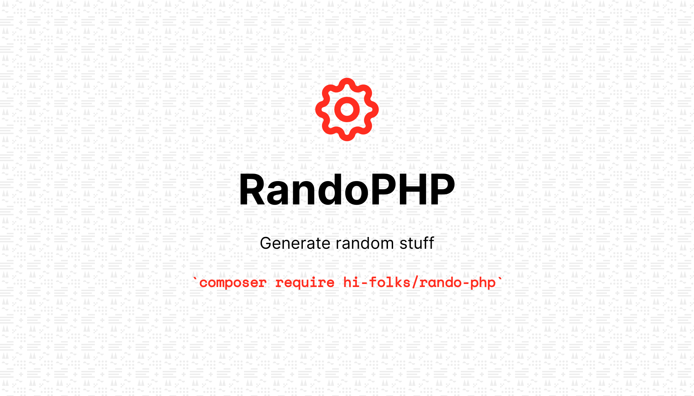

# Rando-PHP




RandoPHP is a PHP open source package for random stuff. With this package you can:
- **Draw**: Extract random items (sample) from an array. This is useful when you want to "draw" some numbers or items;
- **Generate**: useful for create random
   - *item* like integer, byte, boolean, char (numeric, alphabetic, alphanumeric);
   - *sequences* like array of integer;

With the fluent interface you can control some things like:
- minimum and maximum value for generation;
- how many items you want to create;
- for sequences if you want or not duplicates ([1,5,3,1,1], 1 is duplicate or [1,6,5,3,8], no duplicates);
- And other stuff, see the documentation for more options.
 
## Installation

You can install the package via composer:

```bash
composer require hi-folks/rando-php
```

## Usage

### Generate Char

Sometimes you want to obtain a random char, for example, a numeric char:

```php
Randomize::char()->numeric()->generate();
```
Or you might want an alphabetic char:

```php
Randomize::char()->alpha()->generate();
```

You can even do both!
```php
Randomize::char()->alphanumeric()->generate();
```

### Generate Boolean

Sometimes you want to obtain a random boolean true or false (flip a coin):

``` php
$randomBool = Randomize::boolean()->generate();
```

### Generate an Integer

Sometimes you want to obtain a random integer (min - max rang). For example, you want to roll the dice:

``` php
$randomNumber = Randomize::integer()->min(1)->max(6)->generate();
```

### Generate an Range

Set the range (min and max) Calling range(1,10), it is equivalent of ->min(1)->max(10):

``` php
$randomNumber = Randomize::integer()->range(1,10)->generate();
```

### Generate bytes
Sometime you want to obtain some random bytes (hexadecimal). For example, you want to generate a random RGB color (a hex triplet in hexadecimal format):

```php
$randomRGB = Randomize::byte()->length(3)->generate();
```

### Generate sequences
Sometime you want to obtain some random sequences. For example, you want to roll the dice 15 times:

```php
$randomRolls = Randomize::sequence()->min(1)->max(6)->count(15)->generate();
```

Sometime you want to obtain some random char sequences. For example, char sequences of length 10:

```php
$randomChars = Randomize::sequence()->chars()->count(10)->generate();
```

Or you might want numeric char sequences.

```php
$randomChars = Randomize::sequence()->chars()->numeric()->count(10)->generate();
```

Or you might want alphabetical char sequences.

```php
$randomChars = Randomize::sequence()->chars()->alpha()->count(10)->generate();
```

Yes, even both.

```php
$randomChars = Randomize::sequence()->chars()->alphanumeric()->count(10)->generate();
```

### Generate sequences with no duplicates
Sometime you want to obtain some random sequences with **no duplicates**. For example, you want to play "Tombola" (extracting number from 1 to 90 with NO duplicates):

```php
$randomTombola = Randomize::sequence()->min(1)->max(90)->count(90)->noDuplicates()->generate();
```

Sometime you want to obtain some random char sequences with **no duplicates**.

```php
$randomChars = Randomize::sequence()->chars()->count(10)->noDuplicates()->generate();
```

Or you might want numeric char sequences with **no duplicates**. For example, char sequences of length 10:

```php
$randomChars = Randomize::sequence()->chars()->numeric()->count(10)->noDuplicates()->generate();
```

Or you might want alphabetical char sequences with **no duplicates**.

```php
$randomChars = Randomize::sequence()->chars()->alpha()->count(10)->noDuplicates()->generate();
```

Yes, even both and with **no duplicates**.

```php
$randomChars = Randomize::sequence()->chars()->alphanumeric()->count(10)->noDuplicates()->generate();
```

### Suggest which JS framework you could use in your next project (random)
```php
$array=["React.js", "Vue.js", "Svelte.js", "Angular.js" , "Alpine.js", "Vanilla js"];
$randomJs = Draw::sample($array)->extract();
```

### Extract 3 JS framework you could use in your next project
```php
$array=["React.js", "Vue.js", "Svelte.js", "Angular.js" , "Alpine.js", "Vanilla js"];
$randomJs = Draw::sample($array)->count(3)->extract();
```

### Extract 3 JS framework (duplicates allowed)
```php
$array = ["React.js", "Vue.js", "Svelte.js", "Angular.js", "Alpine.js", "Vanilla js"];
$randomJs = Draw::sample($array)->count(3)->allowDuplicates()->extract();
```


### Testing

``` bash
composer test
```

If you want to see some coverage report you can execute phpunit with coverage-text option:

```bash
vendor/bin/phpunit --coverage-text
```

### Warning :warning:

Under the hood RandoPHP uses some native PHP functions like:
- array_rand(): [PHP Doc for array_rand](https://www.php.net/manual/en/function.array-rand.php);
- random_int(): [PHP Doc for random_int](https://www.php.net/manual/en/function.random-int.php);
- shuffle(): [PHP Doc for shuffle](https://www.php.net/manual/en/function.shuffle);
- random_bytes(): [PHP Doc for random_bytes](https://www.php.net/manual/en/function.random-bytes).

These PHP functions use a pseudo random number generator that is not suitable for cryptographic purposes.


### Changelog

Please see [CHANGELOG](CHANGELOG.md) for more information what has changed recently.

## Contributing

Please see [CONTRIBUTING](CONTRIBUTING.md) for details.

### Submit ideas or feature requests or issues
Take a look if your request is already there https://github.com/Hi-Folks/rando-php/issues
If it is not present, you can create a new one https://github.com/Hi-Folks/rando-php/issues/new

## Credits

- [Roberto Butti](https://github.com/roberto-butti)
- [All Contributors](../../contributors)
- [PHP Package Boilerplate](https://laravelpackageboilerplate.com)

## License

The MIT License (MIT). Please see [License File](LICENSE.md) for more information.


